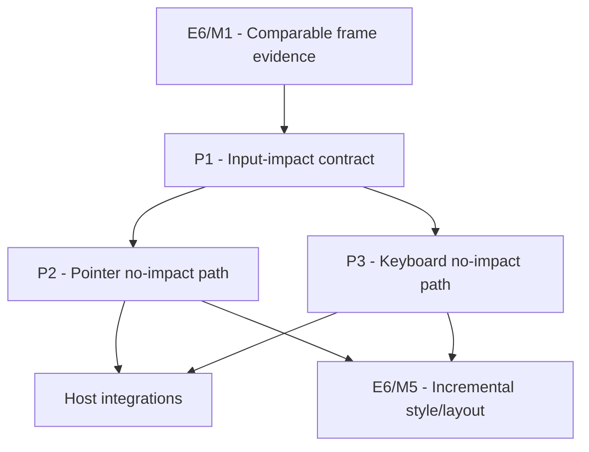

# M1.5: Skip Proven No-Impact Input Frames

## Document Context

- Document Type: Milestone implementation plan
- Status: Complete
- Created: 2026-08-12
- Parent Plan: `docs/work/E6 - Frame pipeline performance.md`

## Goal

Expose a conservative input-processing outcome that lets a host skip full style/layout refresh only
when SpinyGUI can prove that presentation remained unchanged.

## Non-Goals

- No optimistic prediction based only on event type, target identity, or lack of DOM mutation.
- No fine-grained paint-only, style-only, or layout-only result before M5 owns incremental boundaries.
- No selector, property-store, traversal, renderer, or retained-layout optimization.
- No host frame limiting, VSync, or gameplay-input policy.

## Context

Hosts currently have no explicit way to learn whether queued input changed SpinyGUI presentation.
They may therefore conservatively refresh style and layout whenever any pointer, key, or character
input is present. This is correct but expensive for high-rate same-target pointer motion and keyboard
events that no GUI control consumes.

The first contract is deliberately binary. `UNCHANGED` is an evidence claim; every actual effect and
every unclassified path returns `FULL_REFRESH_REQUIRED`. This milestone skips whole refreshes only and
does not overlap M5's later incremental style/layout design.

## Assumptions and Open Questions

- Assumption: Input processing remains on the UI thread and can aggregate listener/state outcomes for
  one processing batch.
- Assumption: Existing callers that do not opt into the new result retain force-full-compatible
  behavior.
- Assumption: Arbitrary application listeners are full-refresh-required unless they participate in a
  future explicit mutation contract.
- Question: The concrete type and method names should follow the nearest event-processor API pattern;
  the semantic two-outcome contract is fixed by this plan.

## Phases

### P1: Define Conservative Input-Impact Contract

**Document:** [P1 - Define conservative input-impact contract](M1.5/P1%20-%20Define%20conservative%20input-impact%20contract.md)
**Depends on:** M1. **Enables:** P2, P3. **Parallelizable with:** None.
**Purpose:** Define result semantics, aggregation, fallback, compatibility, and observability before
optimizing any event path.

### P2: Skip Unchanged Pointer Refresh

**Document:** [P2 - Skip unchanged pointer refresh](M1.5/P2%20-%20Skip%20unchanged%20pointer%20refresh.md)
**Depends on:** P1. **Enables:** milestone validation. **Parallelizable with:** P3 after P1.
**Purpose:** Return unchanged for same-target pointer movement only when all pointer-related UI effects
are proven absent.

### P3: Skip UI-Irrelevant Keyboard Refresh

**Document:** [P3 - Skip UI-irrelevant keyboard refresh](M1.5/P3%20-%20Skip%20UI-irrelevant%20keyboard%20refresh.md)
**Depends on:** P1. **Enables:** milestone validation and Rogue Crawler M21/P5/T2 integration.
**Parallelizable with:** P2 after P1.
**Purpose:** Return unchanged for key/character input only when no GUI consumer or state transition can
affect presentation.

## Milestone Validation

- [x] Event tests prove aggregation is conservative across mixed batches: one full-refresh-required or
  unknown event makes the whole batch full-refresh-required.
- [x] Same-target pointer and unused keyboard scenarios stop requesting full refresh.
- [x] Hover enter/exit, press/release, click, focus, drag, selection, scrollbar, wheel, text editing,
  shortcut, and arbitrary listener scenarios remain force-full-equivalent.
- [x] Counters expose unchanged, known-effect, and unknown-fallback decisions without per-event logging.
- [x] Matched capped and uncapped recordings report input events, refresh requests, allocation per frame,
  allocation per second, CPU, and GC.

## Evidence

The backend-neutral `:spinygui.benchmark:inputImpactEvidence` task records idle,
pointer-active, keyboard-active, and mixed-input scenarios at uncapped, 120 Hz, and 60 Hz rates.
Each recording includes input-batch counts, unchanged/full-refresh decisions, allocation per frame
and per second, CPU per frame and per second, and GC counts/time. Hosts consume the binary result from
the system and GUI processors and combine them with `InputProcessingResult.aggregate`.

## Review Boundaries

- In scope: system/GUI event processing result, conservative effect tracking, tests, counters, and
  narrow host-facing compatibility.
- Out of scope: changes to event delivery semantics, incremental styling/layout, renderer work,
  application-specific gameplay routing, or frame policy.

## Dependency Graph

