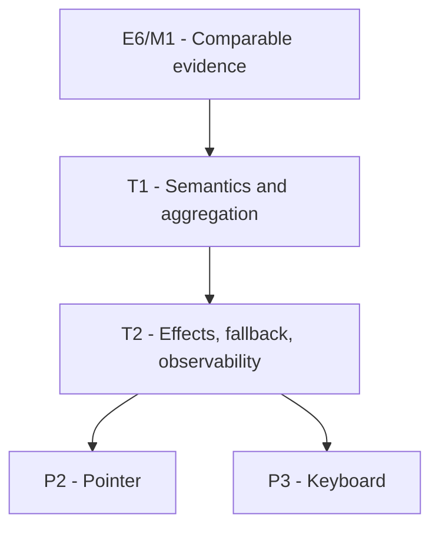

# P1: Define Conservative Input-Impact Contract

## Document Context

- Document Type: Phase implementation plan
- Status: Proposed
- Created: 2026-08-12
- Parent Milestone: E6/M1.5 - Skip Proven No-Impact Input Frames

## Goal

Define a backend-neutral, conservative result for one input-processing batch before any event path is
allowed to skip host style/layout refresh.

## Phase Tasks

### T1: Define Result Semantics and Aggregation

**Purpose:** Make `UNCHANGED` a proof and keep actual or unknown effects on the safe full-refresh path.
**Depends on:** E6/M1. **Enables:** T2. **Parallelizable with:** None.
**Changes:**
- [x] Add or evolve the event-processor API with two semantic outcomes: proven unchanged and full
  refresh required, with unknown folded into the latter.
- [x] Define batch aggregation so any effect/unknown dominates unchanged events.
- [x] Preserve source/binary compatibility where required, or provide an explicit migration adapter
  whose behavior remains full-refresh-compatible.
- [x] Keep the contract in core event/input ownership without backend or host dependencies.
**Acceptance Checks:**
- [x] An empty or fully proven-no-impact batch reports unchanged.
- [x] Any mixed batch containing an effect or unknown reports full refresh required.
- [x] Legacy callers cannot accidentally acquire optimistic skip behavior.
**Risks:** A nullable, tri-state, or implicitly defaulted result could make unknown input appear safe.

### T2: Define Effect Sources, Fallback, and Observability

**Purpose:** Enumerate what must invalidate presentation and make decisions measurable without noisy
per-event logs.
**Depends on:** T1. **Enables:** P2 and P3. **Parallelizable with:** None.
**Changes:**
- [x] Classify hover path, focus, pressed state, scroll offsets, drag/capture, text/caret/selection,
  shortcut actions, DOM/style/class changes, and arbitrary listener dispatch as effects or unknowns.
- [x] Define how internal listeners report known effects and how uninstrumented application listeners
  force the fallback.
- [x] Add counters for proven unchanged, known effect, and unknown fallback at processing-batch scope.
- [x] Add reference tests that compare optimized decisions with forced full-refresh execution.
**Acceptance Checks:**
- [x] Every current system event listener has an explicit conservative classification rule.
- [x] Unclassified listeners/events cannot produce unchanged.
- [x] Counters identify why refresh was retained without logging each frame or event.
**Risks:** State changes outside the event processor can escape classification; those paths remain
full-refresh-required until ownership is explicit.

## Verification Strategy

- Run core event-processor and system-listener tests.
- Add mixed-batch, legacy-call, unknown-event, and arbitrary-listener cases.
- Review module exports if the host-facing result becomes public API.

## Implemented Contract

- `EventProcessor.processEventsWithResult()` and `SystemEventProcessor.processEventsWithResult()` expose
  the binary result while the existing `processEvents()` methods remain force-full-compatible.
- `InputProcessingBatch` uses `PROVEN_UNCHANGED`, `KNOWN_EFFECT`, and `UNKNOWN_FALLBACK` internally;
  only the first maps to `UNCHANGED`.
- Existing system and GUI listeners dispatch through conservative default adapters. Legacy or
  uninstrumented listeners mark `UNKNOWN_FALLBACK`; future pointer and keyboard phases must override
  the adapter only when they can prove no presentation effect.
- `InputProcessingCounters` records one cumulative decision per processing batch without event-level
  logging.

## Dependency Graph

