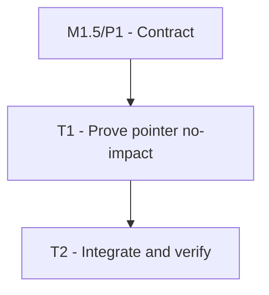

# P2: Skip Unchanged Pointer Refresh

## Document Context

- Document Type: Phase implementation plan
- Status: Proposed
- Created: 2026-08-12
- Parent Milestone: E6/M1.5 - Skip Proven No-Impact Input Frames

## Goal

Classify same-target pointer movement as unchanged only when processing proves that it cannot affect
hover, capture, drag, selection, scrollbars, listeners, or any other presentation state.

## Phase Tasks

### T1: Prove the Same-Hit-Path No-Impact Case

**Purpose:** Establish the minimum safe pointer fast path using existing hit-path and interaction state.
**Depends on:** M1.5/P1. **Enables:** T2. **Parallelizable with:** None.
**Changes:**
- [ ] Compare previous and current hit paths without allocating temporary collections on the target
  steady-state path.
- [ ] Return unchanged only when the hit path is stable, no enter/exit transition occurs, no button or
  wheel event is present, no capture/drag/selection/scrollbar state is active, and no move listener or
  other consumer can affect presentation.
- [ ] Preserve cursor-position state required for later correct click, drag, scroll, and hit testing.
- [ ] Route every ambiguous pointer state to full refresh required.
**Acceptance Checks:**
- [ ] Repeated motion inside one inert element reports unchanged after warmup.
- [ ] Crossing element boundaries, active capture/drag/selection, and listener-bearing targets never
  use the no-impact path without explicit proof.
- [ ] Hit testing and stored pointer coordinates remain equivalent to force-full processing.
**Risks:** Target identity alone is insufficient because movement listeners and captured interactions
may mutate presentation without a hover-path change.

### T2: Integrate and Verify Pointer Decisions

**Purpose:** Make the pointer outcome consumable by hosts and prove safe behavior across interaction
boundaries.
**Depends on:** T1. **Enables:** M1.5 validation. **Parallelizable with:** None.
**Changes:**
- [ ] Aggregate pointer outcomes into the processing-batch result and structural counters.
- [ ] Add tests for inert same-target motion, enter/exit, press/release/click, drag, selection,
  scrollbar interaction, wheel scroll, transformed hit testing, and arbitrary listeners.
- [ ] Compare optimized and forced-full state/render results for representative fixtures.
- [ ] Record matched pointer-active allocation and refresh-request evidence.
**Acceptance Checks:**
- [ ] No-impact motion reduces refresh requests without changing event delivery or pointer state.
- [ ] All pointer interactions with actual or unknown effects retain full refresh required.
- [ ] Evidence reports both per-frame and per-second cost.
**Risks:** Benchmarks can reward skipped listener delivery; event delivery semantics must remain
unchanged and only the subsequent style/layout decision may be skipped.

## Verification Strategy

- Run focused core system-event and GUI-event tests, followed by the full core test suite.
- Use deterministic hit-test fixtures and force-full state/render comparison.
- Capture both capped and uncapped pointer-active recordings.

## Dependency Graph

