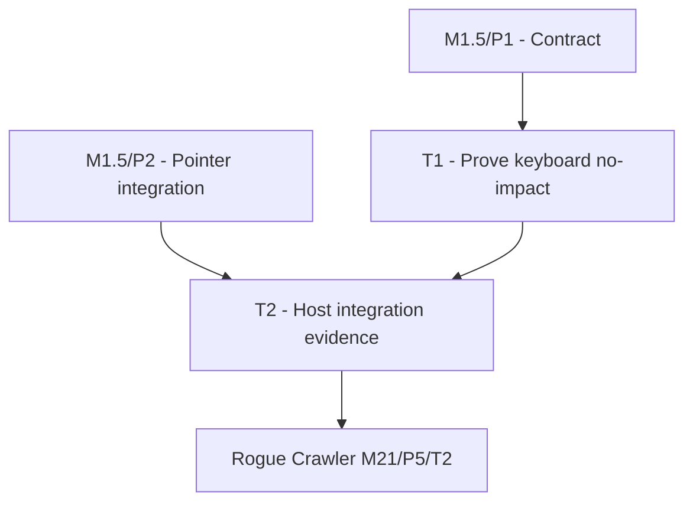

# P3: Skip UI-Irrelevant Keyboard Refresh

## Document Context

- Document Type: Phase implementation plan
- Status: Proposed
- Created: 2026-08-12
- Parent Milestone: E6/M1.5 - Skip Proven No-Impact Input Frames

## Goal

Classify key and character input as unchanged only when no focused control, editor, shortcut,
listener, or other GUI state consumes it.

## Phase Tasks

### T1: Prove the Keyboard No-Impact Case

**Purpose:** Allow application/gameplay keys that have no SpinyGUI effect to avoid full style/layout
refresh without weakening keyboard UI behavior.
**Depends on:** M1.5/P1. **Enables:** T2. **Parallelizable with:** None.
**Changes:**
- [ ] Classify key and character processing through `KeyboardLayout`, focus ownership,
  `ShortcutRegistry`, exact-class listener dispatch, and editable-control state.
- [ ] Return unchanged only when no shortcut/action/listener runs and no focus, value, caret,
  selection, pressed, class/style, or structural state changes.
- [ ] Treat uninstrumented application listeners and unknown key/character event types as full refresh
  required.
- [ ] Preserve event delivery and keyboard state even when the subsequent refresh can be skipped.
**Acceptance Checks:**
- [ ] An unused gameplay key with no GUI consumer reports unchanged.
- [ ] Focused editing, shortcuts, focus navigation, key listeners, and character input with a consumer
  report full refresh required.
- [ ] Key-up/down and character batching obey the conservative aggregation contract.
**Risks:** A key can affect UI through shortcuts or arbitrary listeners even without editable focus;
focus absence alone is not proof.

### T2: Verify Host Integration and Comparative Evidence

**Purpose:** Prove the contract supports host movement input without coupling SpinyGUI to game-specific
keys or frame policy.
**Depends on:** T1 and M1.5/P2/T2 for combined-input evidence. **Enables:** Rogue Crawler M21/P5/T2
and M1.5 validation. **Parallelizable with:** None.
**Changes:**
- [ ] Add tests for unused keys, focused editing, shortcuts, arbitrary listeners, mixed pointer/key
  batches, and explicit UI mutation.
- [ ] Provide a backend-neutral integration fixture or example showing a host consuming the batch
  result after normal event delivery.
- [ ] Compare optimized and force-full presentation/state for the keyboard matrix.
- [ ] Record matched idle, keyboard-active, pointer-active, and mixed-input evidence with counters,
  allocation per frame/second, CPU, and GC.
**Acceptance Checks:**
- [ ] The host can skip refresh for unused keys without naming gameplay keys inside SpinyGUI.
- [ ] A mixed batch skips only when every event is proven unchanged.
- [ ] Actual and unknown GUI effects remain visually equivalent to force-full execution.
- [ ] The public integration contract is documented sufficiently for Rogue Crawler without importing
  backend-specific types.
**Risks:** A host-specific shortcut around the framework contract would duplicate classification and
drift; the integration example must consume, not reinterpret, the SpinyGUI result.

## Verification Strategy

- Run focused keyboard-layout, shortcut-registry, system-event, GUI-event, and editable-control tests.
- Run the full core test suite and any public API/module checks.
- Capture capped and uncapped keyboard/mixed-input recordings and compare against force-full output.

## Dependency Graph

