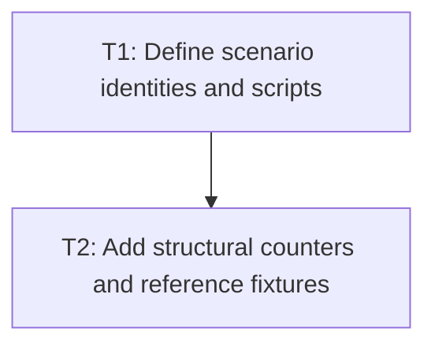

# P1: Define Frame Scenarios and Observability

## Goal
Freeze comparable non-text frame scenarios, counters, and reference fixtures.

## Phase Tasks
### T1: Define scenario identities and scripts
**Depends on:** Accepted E5 (external). **Enables:** T2. **Parallelizable with:** None.
**Changes:**
- [ ] Define collapsed, expanded, pointer-active, scroll, resize, and transform scenarios with declared inputs.
- [ ] Reuse E5 comparability fingerprint rules and separate text-owned counters from E6 counters.
**Acceptance Checks:**
- [ ] Each scenario has a stable identity, warmup, duration, window configuration, and interaction script.

### T2: Add structural counters and reference fixtures
**Depends on:** T1. **Enables:** None. **Parallelizable with:** None.
**Changes:**
- [ ] Record traversal/views, geometry, transforms, scopes, selectors, properties, layout passes, lookup, and mutation work.
- [ ] Add force-full equivalence fixtures for transforms/scroll, cascade, convergence, and tree invariants.
**Acceptance Checks:**
- [ ] Counters distinguish invocation categories without relying solely on sampled allocation events.

## Verification Strategy
- Run the relevant core and NanoVG tests plus the declared recording script.

## Dependency Graph

