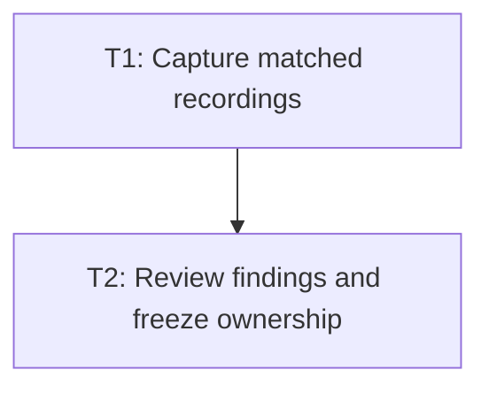

# P2: Capture and Review Baseline Evidence

## Goal
Archive reproducible capped and uncapped frame-path baselines and assign every material hotspot.

## Phase Tasks
### T1: Capture matched recordings
**Depends on:** P1. **Enables:** T2. **Parallelizable with:** None.
**Changes:**
- [ ] Warm and record every approved scenario at uncapped, 120 FPS, and 60 FPS presentation rates.
- [ ] Report allocation/frame, allocation/s, CPU, GC, hot methods/sites, and structural counters.
**Acceptance Checks:**
- [ ] Incomparable environment/settings fingerprints are rejected or marked rather than compared.

### T2: Review findings and freeze ownership
**Depends on:** T1. **Enables:** M1.5, M2, M3, M4, M6. **Parallelizable with:** None.
**Changes:**
- [ ] Map each material category to one E6 milestone or document it as deferred/rejected.
- [ ] Record unexpected findings that invalidate the proposed ordering.
**Acceptance Checks:**
- [ ] Review confirms the baseline separates stable rendering from initial expansion and text-owned work.

## Verification Strategy
- Review archived recording metadata and scenario reports against E5 comparability rules.

## Dependency Graph

