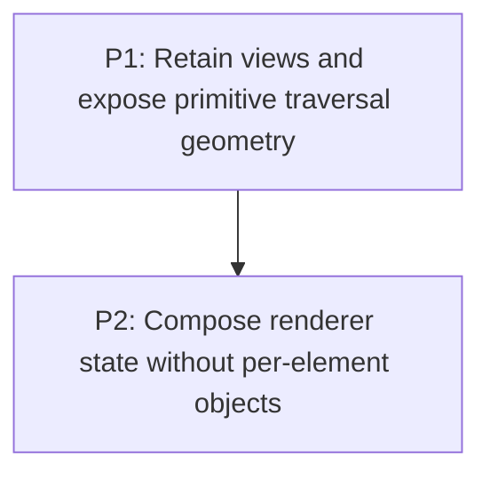

# M2: Remove Steady-State Traversal and Renderer Allocation

**Status:** Planned

Parent plan: `docs/work/E6 - Frame pipeline performance.md`

## Goal

Remove allocation from repeated child traversal, geometry reads, transform composition, clipping, and
NanoVG state scopes while retaining immediate-mode rendering semantics.

## Phases

### P1: Retain views and expose primitive traversal geometry
**Document:** [P1 - Retain views and expose primitive traversal geometry](M2/P1%20-%20Retain%20views%20and%20expose%20primitive%20traversal%20geometry.md)
**Depends on:** M1. **Enables:** P2. **Parallelizable with:** M3/P1, M4/P1, M6/P1.
**Purpose:** Remove wrapper, stream, vector, and rectangle churn without exposing mutable node state.

### P2: Compose renderer state without per-element objects
**Document:** [P2 - Compose renderer state without per-element objects](M2/P2%20-%20Compose%20renderer%20state%20without%20per-element%20objects.md)
**Depends on:** P1. **Enables:** M5. **Parallelizable with:** M3/P2, M4/P2, M6/P2.
**Purpose:** Use direct balanced NanoVG state and primitive transform/clip composition.

## Milestone Validation
- Steady-state renderer paths avoid wrapper, stream, temporary geometry, transform, and state-scope allocation.
- Nested transform, scroll, clip, hit-test, and exception fixtures remain equivalent.

## Dependency Graph

