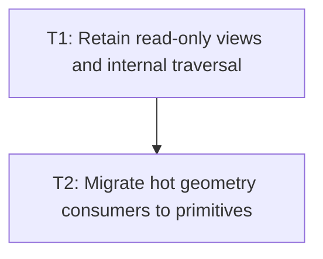

# P1: Retain Views and Expose Primitive Traversal Geometry

## Goal
Remove recurring collection wrappers, filtered child lists, and temporary geometry from internal hot paths.

## Non-Goals
- Caching absolute coordinates or composed transforms.
- Exposing mutable backing collections through public APIs.

## Phase Tasks
### T1: Retain read-only views and internal traversal
**Depends on:** M1. **Enables:** T2. **Parallelizable with:** M3/P1, M4/P1, M6/P1.
**Changes:**
- [ ] Retain immutable views for node, fragment, and resolved-rule backing collections.
- [ ] Add package-private allocation-free element traversal or stable element views for internal consumers.
**Acceptance Checks:**
- [ ] Repeated public access preserves read-only behavior and stable identity; internal traversal avoids streams/filter lists.

### T2: Migrate hot geometry consumers to primitives
**Depends on:** T1. **Enables:** P2. **Parallelizable with:** M3/P1, M4/P1, M6/P1.
**Changes:**
- [ ] Add primitive position/bounds accessors and migrate renderer/layout/hit-test callers that need no vector/rect value.
- [ ] Keep public vector APIs compatible where callers depend on them.
**Acceptance Checks:**
- [ ] Geometry and hit-test fixtures match the reference path with reduced temporary object counters.

## Verification Strategy
- Run node/style/layout tests and NanoVG renderer traversal tests.

## Dependency Graph

