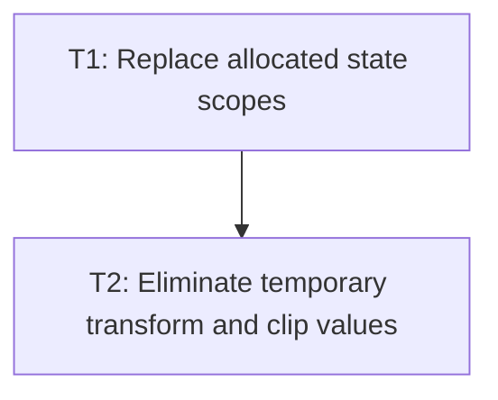

# P2: Compose Renderer State Without Per-Element Objects

## Goal
Use direct balanced NanoVG state and primitive transform/clip calculations during layout-tree rendering.

## Phase Tasks
### T1: Replace allocated state scopes
**Depends on:** P1. **Enables:** T2. **Parallelizable with:** M3/P2, M4/P2, M6/P2.
**Changes:**
- [ ] Replace transform/content scope allocations with `nvgSave`/`nvgRestore` guarded by `try/finally`.
- [ ] Preserve restore behavior when subtree rendering throws.
**Acceptance Checks:**
- [ ] Recording tests prove balanced save/restore on normal and exceptional paths.

### T2: Eliminate temporary transform and clip values
**Depends on:** T1. **Enables:** M5. **Parallelizable with:** M3/P2, M4/P2, M6/P2.
**Changes:**
- [ ] Compose transforms in primitive coefficients or a confined accumulator and submit coefficients directly.
- [ ] Compute clip bounds from primitive box values and retain layout-tree traversal order.
**Acceptance Checks:**
- [ ] Nested transform/scroll/clip visual and hit-test fixtures are equivalent with no per-element state/transform allocation.

## Verification Strategy
- Run NanoVG renderer transform and clipping tests; perform a manual nested-scroll demo smoke.

## Dependency Graph

