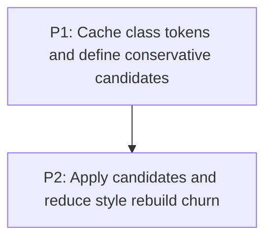

# M3: Reduce Selector Candidate and Style-Rebuild Work

Parent plan: `docs/work/E6 - Frame pipeline performance.md`

## Goal

Eliminate repeated class regex/tokenization and reduce all-rule style matching without changing CSS
cascade, selector, or pseudo-state behavior.

## Phases

### P1: Cache class tokens and define conservative candidates
**Document:** [P1 - Cache class tokens and define conservative candidates](M3/P1%20-%20Cache%20class%20tokens%20and%20define%20conservative%20candidates.md)
**Depends on:** M1. **Enables:** P2. **Parallelizable with:** M2/P1, M4/P1, M6/P1.
**Purpose:** Move class parsing to attribute mutation and approve no-false-negative candidate indexing.

### P2: Apply candidates and reduce style rebuild churn
**Document:** [P2 - Apply candidates and reduce style rebuild churn](M3/P2%20-%20Apply%20candidates%20and%20reduce%20style%20rebuild%20churn.md)
**Depends on:** P1. **Enables:** M5. **Parallelizable with:** M2/P2, M4/P2, M6/P2.
**Purpose:** Integrate candidate filtering and owned reusable style buffers under conformance tests.

## Milestone Validation
- Candidate filtering cannot omit a matching selector or alter specificity/source ordering.
- Regex and unrelated-rule work are materially reduced in comparable recordings.

## Dependency Graph

