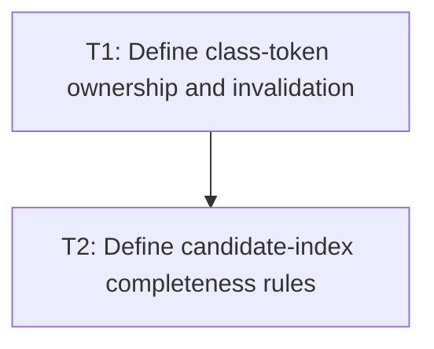

# P1: Cache Class Tokens and Define Conservative Candidates

## Goal
Move class parsing to mutation time and approve a selector candidate model that cannot exclude matches.

## Phase Tasks
### T1: Define class-token ownership and invalidation
**Depends on:** M1. **Enables:** T2. **Parallelizable with:** M2/P1, M4/P1, M6/P1.
**Changes:**
- [ ] Define normalized class-token behavior for whitespace, empty values, and duplicates.
- [ ] Update tokens only when the class attribute changes without leaking mutable sets.
**Acceptance Checks:**
- [ ] Existing class-selector results remain identical for tabs, repeated spaces, empty attributes, and mutation.

### T2: Define candidate-index completeness rules
**Depends on:** T1. **Enables:** P2. **Parallelizable with:** M2/P1, M4/P1, M6/P1.
**Changes:**
- [ ] Specify candidate buckets for ID, class, tag, pseudo-state, universal, and selectors requiring fallback.
- [ ] Prove combinators and source ordering remain matcher/cascade responsibilities.
**Acceptance Checks:**
- [ ] Every selector form is assigned to a safe candidate or universal fallback; no false-negative example exists.

## Verification Strategy
- Run selector conformance tests before implementation proceeds.

## Dependency Graph

