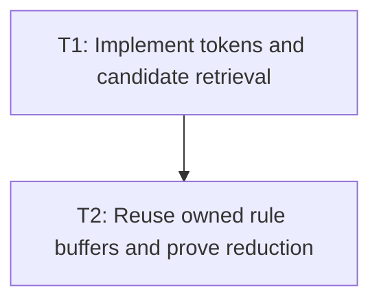

# P2: Apply Candidates and Reduce Style Rebuild Churn

## Goal
Integrate cached tokens and candidate filtering while reducing temporary style-resolution collections.

## Phase Tasks
### T1: Implement tokens and candidate retrieval
**Depends on:** P1. **Enables:** T2. **Parallelizable with:** M2/P2, M4/P2, M6/P2.
**Changes:**
- [ ] Replace regex class tests with cached token membership.
- [ ] Retrieve conservative candidate rules before existing final matching and cascade ordering.
**Acceptance Checks:**
- [ ] Selector fixtures preserve matching, specificity, source order, inheritance, and pseudo-states.

### T2: Reuse owned rule buffers and prove reduction
**Depends on:** T1. **Enables:** M5. **Parallelizable with:** M2/P2, M4/P2, M6/P2.
**Changes:**
- [ ] Remove temporary rule/filter/sort collections only where ownership is unambiguous.
- [ ] Record candidate, tested-rule, and allocation counters.
**Acceptance Checks:**
- [ ] Comparable recordings show reduced regex and unrelated-rule work without retained cross-frame leaks.

## Verification Strategy
- Run style-manager and selector tests plus M1 scenarios.

## Dependency Graph

