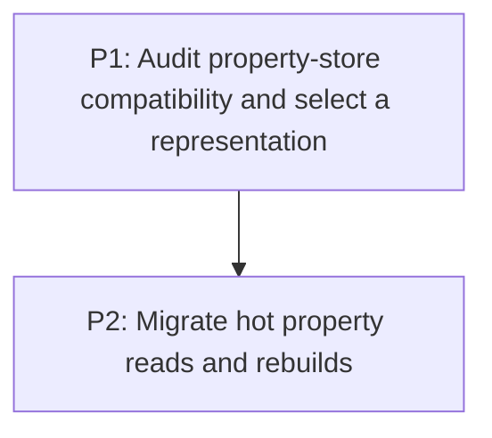

# M4: Redesign Hot Resolved-Property Storage

**Status:** Planned

Parent plan: `docs/work/E6 - Frame pipeline performance.md`

## Goal

Reduce resolved-style lookup and rebuild cost while preserving typed property access, defaults,
declaration application, and any observable map behavior.

## Phases

### P1: Audit property-store compatibility and select a representation
**Document:** [P1 - Audit property-store compatibility and select a representation](M4/P1%20-%20Audit%20property-store%20compatibility%20and%20select%20a%20representation.md)
**Depends on:** M1. **Enables:** P2. **Parallelizable with:** M2/P1, M3/P1, M6/P1.
**Purpose:** Determine whether a faster map is compatible or indexed slots are required.

### P2: Migrate hot property reads and rebuilds
**Document:** [P2 - Migrate hot property reads and rebuilds](M4/P2%20-%20Migrate%20hot%20property%20reads%20and%20rebuilds.md)
**Depends on:** P1. **Enables:** M5. **Parallelizable with:** M2/P2, M3/P2, M6/P2.
**Purpose:** Implement the approved representation and eliminate avoidable unchanged copies.

## Milestone Validation
- Existing style/property tests and listener behavior remain compatible.
- Measurements confirm the chosen representation reduces hot lookup/rebuild work.

## Dependency Graph

