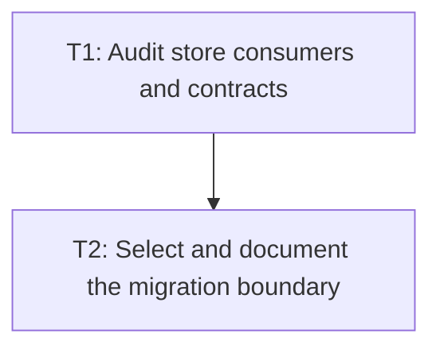

# P1: Audit Property-Store Compatibility and Select a Representation

## Goal
Choose a faster resolved-property representation only after auditing observable `styles()` behavior.

## Phase Tasks
### T1: Audit store consumers and contracts
**Depends on:** M1. **Enables:** T2. **Parallelizable with:** M2/P1, M3/P1, M6/P1.
**Changes:**
- [ ] Identify consumers of map ordering, mutability, iteration, listener snapshots, typed getters, and custom properties.
- [ ] Record hot built-in property reads and rebuild operations from M1 scenarios.
**Acceptance Checks:**
- [ ] The audit states whether sorted order is observable and which compatibility tests protect it.

### T2: Select and document the migration boundary
**Depends on:** T1. **Enables:** P2. **Parallelizable with:** M2/P1, M3/P1, M6/P1.
**Changes:**
- [ ] Compare faster-map and indexed-slot designs against compatibility and evidence.
- [ ] Define custom-property storage and listener snapshot behavior for the selected design.
**Acceptance Checks:**
- [ ] The selected approach has a bounded implementation surface and a rollback criterion.

## Verification Strategy
- Run resolved-style, property-provider, and style-manager tests.

## Dependency Graph

