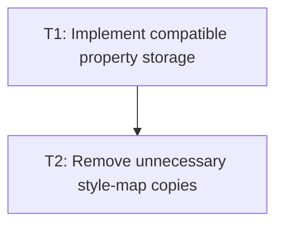

# P2: Migrate Hot Property Reads and Rebuilds

## Goal
Implement the approved property representation and avoid copies/rebuilds that have no consumer.

## Phase Tasks
### T1: Implement compatible property storage
**Depends on:** P1. **Enables:** T2. **Parallelizable with:** M2/P2, M3/P2, M6/P2.
**Changes:**
- [ ] Migrate storage and typed getters according to P1's selected boundary.
- [ ] Preserve defaults, declaration application, extension/custom storage, and documented iteration behavior.
**Acceptance Checks:**
- [ ] Existing resolved-style and CSS property fixtures pass unchanged unless an approved migration updates them.

### T2: Remove unnecessary style-map copies
**Depends on:** T1. **Enables:** M5. **Parallelizable with:** M2/P2, M3/P2, M6/P2.
**Changes:**
- [ ] Avoid previous/new style snapshots when no listener consumes them.
- [ ] Avoid rebuilding unchanged entries where the final contract permits it.
**Acceptance Checks:**
- [ ] Listener and no-listener paths have explicit tests and matched measurements show the intended reduction.

## Verification Strategy
- Run full core style tests and M1 property-heavy scenarios.

## Dependency Graph

