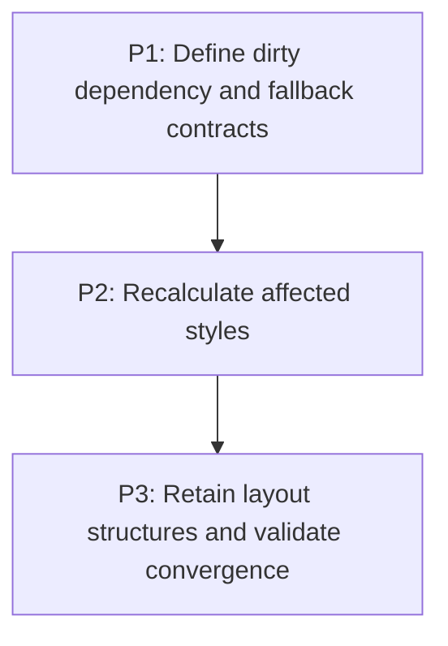

# M5: Add Incremental Style and Retained Layout Boundaries

Parent plan: `docs/work/E6 - Frame pipeline performance.md`

## Goal

Extend E5 whole-domain skipping to correct affected-element style and affected-subtree layout work,
with force-full fallback whenever the dependency boundary is uncertain.

## Phases

### P1: Define dirty dependency and fallback contracts
**Document:** [P1 - Define dirty dependency and fallback contracts](M5/P1%20-%20Define%20dirty%20dependency%20and%20fallback%20contracts.md)
**Depends on:** M2, M3, M4, M6. **Enables:** P2. **Parallelizable with:** None.
**Purpose:** Specify causes, affected roots, UI-thread ownership, E5 session integration, and correctness fallback.

### P2: Recalculate affected styles
**Document:** [P2 - Recalculate affected styles](M5/P2%20-%20Recalculate%20affected%20styles.md)
**Depends on:** P1. **Enables:** P3. **Parallelizable with:** None.
**Purpose:** Implement dependency-aware style invalidation and complete fallback behavior.

### P3: Retain layout structures and validate convergence
**Document:** [P3 - Retain layout structures and validate convergence](M5/P3%20-%20Retain%20layout%20structures%20and%20validate%20convergence.md)
**Depends on:** P2. **Enables:** None. **Parallelizable with:** None.
**Purpose:** Reuse layout structures/buffers and limit work to affected subtrees and ancestors.

## Milestone Validation
- Incremental results match force-full geometry, overflow, transform, interaction, and scrollbar outcomes.
- Unknown or unsupported changes take the full fallback path rather than publishing stale state.

## Dependency Graph

