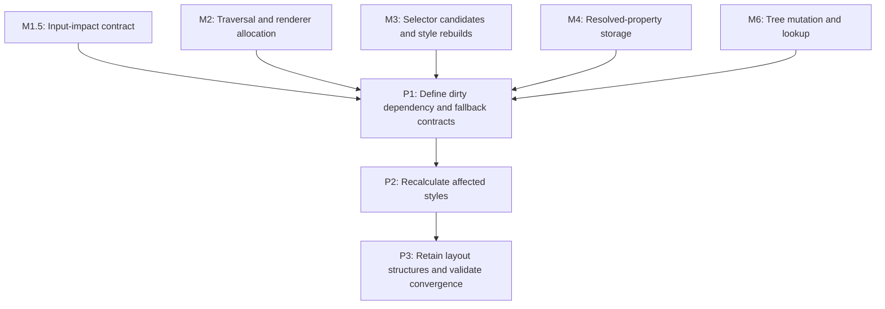

# M5: Add Incremental Style and Retained Layout Boundaries

**Status:** Planned

Parent plan: `docs/work/E6 - Frame pipeline performance.md`

## Document Context

- Parent: [E6 - Frame pipeline performance](../E6%20-%20Frame%20pipeline%20performance.md)
- Children: [P1 - Define dirty dependency and fallback contracts](M5/P1%20-%20Define%20dirty%20dependency%20and%20fallback%20contracts.md), [P2 - Recalculate affected styles](M5/P2%20-%20Recalculate%20affected%20styles.md), [P3 - Retain layout structures and validate convergence](M5/P3%20-%20Retain%20layout%20structures%20and%20validate%20convergence.md)
- Related: E5 whole-frame session and force-full contracts; E6/M1.5 input-impact contract; E6/M2-M4 traversal, selector, and property boundaries; E6/M6 structural mutation ownership
- Next: P1

## Goal

Extend E5 whole-domain skipping to correct affected-element style and affected-subtree layout work,
with force-full fallback whenever the dependency boundary is uncertain.

## Non-Goals

- Per-node layout caching without a containing-block or formatting-context dependency model.
- Changes to CSS cascade, selector specificity, text shaping, renderer ownership, or public behavior.
- Automatic observation of every existing mutable alias; unobservable mutations remain explicit
  invalidation or force-full responsibilities.

## Context

- `StyleManager.recalculate` and `LayoutService.layout` remain force-full compatibility paths.
- The current layout service rebuilds layout-child membership, recalculates scroll/client sizes, and
  resolves presentation transforms after recursively laying out the frame.
- Block flow, inline formatting, Flex/Yoga, Grid placement, positioned descendants, and scrollbar
  convergence have different invalidation granularity; the smallest safe unit is not always one node.
- Incremental publication is UI-thread confined and must remain compatible with E5 epochs/watermarks.

## Phases

### P1: Define dirty dependency and fallback contracts
**Document:** [P1 - Define dirty dependency and fallback contracts](M5/P1%20-%20Define%20dirty%20dependency%20and%20fallback%20contracts.md)
**Depends on:** M1.5, M2, M3, M4, M6. **Enables:** P2. **Parallelizable with:** None.
**Purpose:** Specify causes, affected roots, UI-thread ownership, E5 session integration, and correctness fallback.

### P2: Recalculate affected styles
**Document:** [P2 - Recalculate affected styles](M5/P2%20-%20Recalculate%20affected%20styles.md)
**Depends on:** P1. **Enables:** P3. **Parallelizable with:** None.
**Purpose:** Implement dependency-aware style invalidation and complete fallback behavior.

### P3: Retain layout structures and validate convergence
**Document:** [P3 - Retain layout structures and validate convergence](M5/P3%20-%20Retain%20layout%20structures%20and%20validate%20convergence.md)
**Depends on:** P2. **Enables:** None. **Parallelizable with:** None.
**Purpose:** Reuse layout structures/buffers and limit work to affected subtrees and ancestors.

## Milestone Validation
- Incremental results match force-full geometry, overflow, transform, interaction, and scrollbar outcomes.
- Unknown or unsupported changes take the full fallback path rather than publishing stale state.

## Dependency Graph

