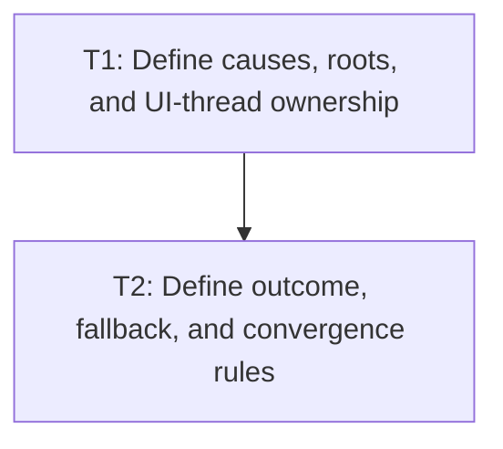

# P1: Define Dirty Dependency and Fallback Contracts

## Goal
Specify safe affected-root invalidation that extends, rather than changes, E5 whole-frame session behavior.

## Phase Tasks
### T1: Define causes, roots, and UI-thread ownership
**Depends on:** M2, M3, M4, M6. **Enables:** T2. **Parallelizable with:** None.
**Changes:**
- [ ] Define style/layout dirty causes for DOM, class/style, pseudo-state, font, resize, scroll, transforms, visibility, and scrollbars.
- [ ] Define affected descendants/ancestors and the relationship to E5 epochs and force-full calls.
**Acceptance Checks:**
- [ ] Each cause has an explicit affected-root rule or is assigned to force-full fallback.

### T2: Define outcome, fallback, and convergence rules
**Depends on:** T1. **Enables:** P2. **Parallelizable with:** None.
**Changes:**
- [ ] Define stale-output refusal, fallback escalation, scrollbar max-pass/failure, and no-global-dirty-flag behavior.
- [ ] Define reference comparison against full style/layout execution.
**Acceptance Checks:**
- [ ] Unknown mutation cannot be treated as safely incremental.

## Verification Strategy
- Review against E5/M8 session contracts and core layout/style tests.

## Dependency Graph

