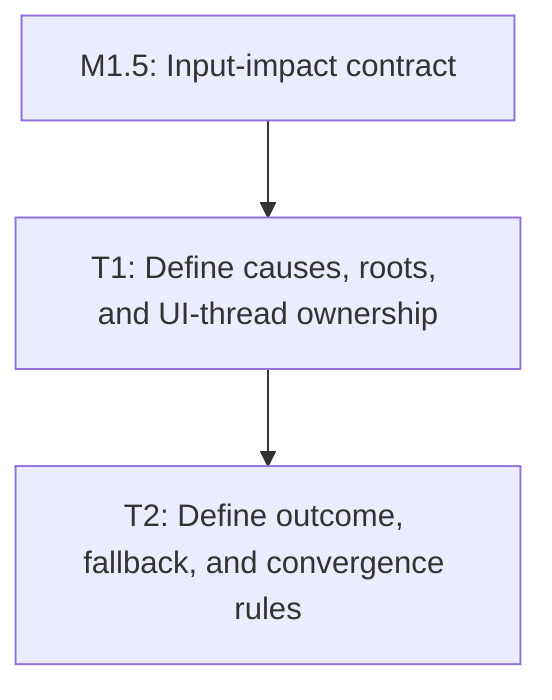

# P1: Define Dirty Dependency and Fallback Contracts

## Document Context

- Parent: [M5 - Add incremental style and retained layout boundaries](../M5%20-%20Add%20incremental%20style%20and%20retained%20layout%20boundaries.md)
- Children: None; tasks are contained in this phase document.
- Related: E5/M8 whole-frame dirty orchestration; `LayoutServiceImpl`; `StyleManagerImpl`; block,
  inline, flex, and grid layout implementations.
- Next: [P2 - Recalculate affected styles](P2%20-%20Recalculate%20affected%20styles.md)

## Goal

Specify safe affected-root invalidation that extends, rather than changes, E5 whole-frame session
behavior. The contract must identify when a mutation can target a formatting context and when it must
escalate to full style/layout execution.

## Non-Goals

- Implementing dirty-state storage or changing layout algorithms in this phase.
- Claiming that direct mutation of unobservable public aliases is automatically tracked.
- Selecting a smallest subtree when parent constraints, sibling flow, flex/grid distribution, or
  scrollbar state can affect the result.

## Context and Assumptions

- Dirty state is UI-thread confined and cannot be cleared globally as a side effect of one session.
- Unknown, superseded, structurally ambiguous, or incomplete dependency information takes the
  force-full path.
- A formatting-context root is a block flow, inline formatting, flex, or grid boundary whose layout
  algorithm can establish descendant geometry under a known containing constraint.

## Phase Tasks

### T1: Define dirty causes and formatting-context roots

**Prerequisites:** M1.5, M2, M3, M4, M6.

**Purpose:** Establish the dependency vocabulary and conservative root-selection rules used by both
style and layout orchestration.

**Changes:**

- [ ] Define dirty causes for DOM attach/detach/move, text/content, class/style/stylesheet,
  pseudo-state, font generation, resize, visibility/display, scroll, transforms, and scrollbar
  geometry.
- [ ] Map causes to affected style roots, block-flow roots, inline formatting contexts, flex/grid
  containers, positioned containing blocks, scroll containers, and ancestor propagation.
- [ ] Define which descendants can remain clean only when their containing constraints and inherited
  inputs are unchanged.
- [ ] Define UI-thread ownership, per-frame/session association, and the relationship to E5 source
  epochs and output watermarks.

**Acceptance Checks:**

- [ ] Every listed cause has an explicit affected-root rule, or is assigned to force-full fallback.
- [ ] The rules explicitly cover block-flow sibling shifts, inline wrapping, flex redistribution,
  grid track/placement changes, positioned descendants, hidden subtrees, and ancestor scrollbars.
- [ ] No rule claims isolated-element recalculation where a parent or sibling algorithm can change the
  result.

**Risks:** False-local invalidation can publish stale geometry; mitigate by escalating any missing
containing-block, selector, ancestor, sibling, or formatting-context dependency to force-full.

### T2: Define outcome, fallback, and convergence rules

**Prerequisites:** T1.

**Purpose:** Define when incremental work is publishable and how stale, failed, or unconverged output
is quarantined.

**Changes:**

- [ ] Define explicit outcomes for incremental success, force-full fallback, stale-input refusal,
  layout failure, and scrollbar non-convergence.
- [ ] Preserve the existing bounded scrollbar pass policy and require successful convergence before
  advancing output watermarks.
- [ ] Define supersession behavior for mutations raised during style/layout work and prohibit a
  global dirty-flag clear.
- [ ] Define the reference execution as the existing force-full style/layout path.

**Acceptance Checks:**

- [ ] Unknown, unsupported, direct-alias, or superseded mutation cannot be treated as safely
  incremental.
- [ ] Failed or unconverged incremental output is not renderable and has a deterministic force-full
  retry path.
- [ ] The contract remains compatible with legacy `StyleManager.recalculate` and
  `LayoutService.layout` calls.

**Risks:** A new outcome contract could accidentally alter legacy void-service behavior; mitigate by
making skip-aware execution opt-in and retaining force-full adapters for existing implementations.

### T3: Define the equivalence and diagnostic matrix

**Prerequisites:** T2.

**Purpose:** Make the dependency contract measurable before implementation changes the layout path.

**Changes:**

- [ ] Define deterministic scenarios for unchanged frames, paint-only changes, text/wrapping changes,
  block-flow height changes, flex redistribution, grid track changes, nested overflow, resize,
  transforms, visibility/display changes, and structural mutation.
- [ ] Define required comparisons for boxes, inline fragments, layout-child membership, offset parents,
  scroll/client sizes, scrollbar metrics, presentation transforms, and hit-test coordinates.
- [ ] Define counters for visited nodes, affected roots, full fallbacks, convergence passes, stale
  refusals, and published incremental outputs.

**Acceptance Checks:**

- [ ] Every scenario has a force-full reference and an observable incremental result comparison.
- [ ] The matrix distinguishes reduced work from merely correct output and records fallback causes.

**Risks:** Timing-only evidence can hide incorrect reuse; mitigate by making structural equality the
primary gate and using benchmarks only after equivalence passes.

## Verification Strategy

- Review against E5/M8 session contracts and the existing core layout/style tests before implementation.
- Reject the phase if any dependency class lacks either a root rule or an explicit force-full fallback.

## Dependency Graph

