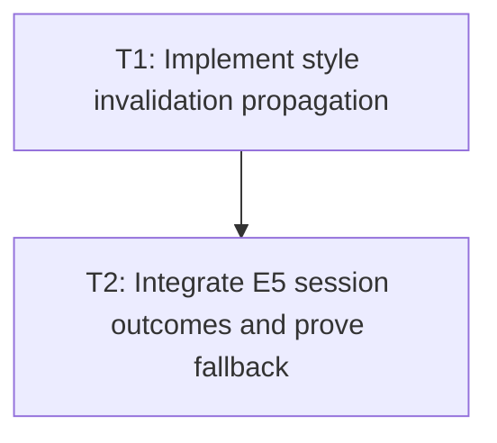

# P2: Recalculate Affected Styles

## Goal
Apply style recomputation to proven affected elements and dependent descendants with a complete fallback.

## Phase Tasks
### T1: Implement style invalidation propagation
**Depends on:** P1. **Enables:** T2. **Parallelizable with:** None.
**Changes:**
- [ ] Track approved style dirty reasons and affected elements/subtrees.
- [ ] Escalate selector/ancestry cases that cannot be proven complete to force-full resolution.
**Acceptance Checks:**
- [ ] Pseudo-state, class, inline style, ancestor, and stylesheet changes match force-full output.

### T2: Integrate E5 session outcomes and prove fallback
**Depends on:** T1. **Enables:** P3. **Parallelizable with:** None.
**Changes:**
- [ ] Publish incremental style outcomes only when current and compatible with E5 session watermarks.
- [ ] Add counters for affected/full resolution and fallback causes.
**Acceptance Checks:**
- [ ] Unsupported or superseded changes execute complete resolution and never publish stale styles.

## Verification Strategy
- Run style-manager, pseudo-state, transition, and E5/M8 integration tests.

## Dependency Graph

