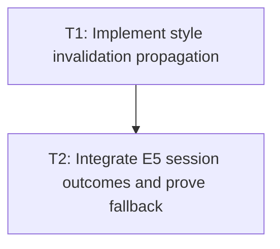

# P2: Recalculate Affected Styles

## Document Context

- Parent: [M5 - Add incremental style and retained layout boundaries](../M5%20-%20Add%20incremental%20style%20and%20retained%20layout%20boundaries.md)
- Children: None; tasks are contained in this phase document.
- Related: [P1 - Define dirty dependency and fallback contracts](P1%20-%20Define%20dirty%20dependency%20and%20fallback%20contracts.md), `StyleManagerImpl`, selector candidate work in E6/M3, property storage work in E6/M4
- Next: [P3 - Retain layout structures and validate convergence](P3%20-%20Retain%20layout%20structures%20and%20validate%20convergence.md)

## Goal

Apply style recomputation to proven affected elements and dependent descendants with a complete
fallback, without allowing incomplete selector or ancestry knowledge to produce stale resolved
styles.

## Non-Goals

- Changing selector matching, specificity, source order, or CSS semantics.
- Replacing E5 whole-frame session orchestration.
- Incrementally resolving a stylesheet mutation unless candidate and dependency completeness is proven.

## Context

- `StyleManagerImpl` currently resolves the frame recursively and invokes the optional
  `StyleChangeListener` for each element.
- Class, inline-style, pseudo-state, ancestor, stylesheet, and font changes have different descendant
  and selector dependencies.
- Direct mutable style/attribute aliases remain explicit invalidation or force-full boundaries unless
  mutation ownership has been repaired by E6/M6.

## Phase Tasks

### T1: Implement style invalidation propagation

**Prerequisites:** P1.

**Purpose:** Connect approved style causes to affected elements and selector-dependent descendants.

**Changes:**

- [ ] Track approved dirty reasons and affected elements/subtrees at the frame-owned or session-owned
  boundary selected by P1.
- [ ] Re-resolve only proven affected elements and selector-dependent descendants; preserve cascade
  ordering and inheritance behavior.
- [ ] Escalate stylesheet, ancestor, combinator, pseudo-state, or direct-alias cases that cannot be
  proven complete to force-full resolution.
- [ ] Preserve the old/new snapshots consumed by `StyleChangeListener` and transition handling.

**Acceptance Checks:**

- [ ] Pseudo-state, class, inline-style, ancestor, and stylesheet changes match force-full resolved
  style output for affected and unaffected elements.
- [ ] Unaffected elements retain valid style state and are not incorrectly treated as freshly resolved.

**Risks:** Incomplete selector dependency propagation can miss descendants or combinator matches;
mitigate by keeping a conservative full-resolution fallback.

### T2: Integrate E5 session outcomes and prove fallback

**Prerequisites:** T1.

**Purpose:** Publish incremental style results only when they are current and compatible with E5
session ownership.

**Changes:**

- [ ] Publish incremental style outcomes only when source epochs, output epochs, and session
  watermarks remain current.
- [ ] Add counters for affected resolution, full resolution, stale refusal, and fallback causes.
- [ ] Ensure failure or supersession leaves the session non-renderable until a successful force-full
  retry.

**Acceptance Checks:**

- [ ] Unsupported or superseded changes execute complete resolution and never publish stale styles.
- [ ] Existing legacy calls still perform complete style resolution.
- [ ] Style, pseudo-state, transition, and font-generation fixtures produce identical resolved styles
  under incremental and force-full execution.

**Risks:** Session integration can duplicate or conflict with E5 domain ownership; mitigate by using
E5 watermarks as the authority and refusing publication when ownership is ambiguous.

## Verification Strategy

- Run style-manager, pseudo-state, transition, and E5/M8 integration tests.
- Add focused equivalence coverage for `StyleManagerImpl`, `TransitionCoordinator`, combinators,
  class/style mutation, and font-generation invalidation before enabling layout reuse.

## Dependency Graph

