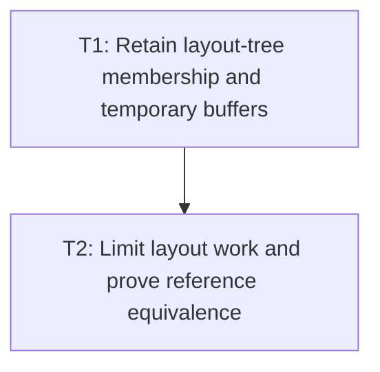

# P3: Retain Layout Structures and Validate Convergence

## Goal
Reuse layout structures and buffers for proven affected subtrees while preserving geometry and scrollbar convergence.

## Phase Tasks
### T1: Retain layout-tree membership and temporary buffers
**Depends on:** P2. **Enables:** T2. **Parallelizable with:** None.
**Changes:**
- [ ] Retain layout-tree nodes and update membership only after structural/positioning changes.
- [ ] Reuse thread-confined contexts and buffers with explicit reset/ownership rules.
**Acceptance Checks:**
- [ ] Structural and visibility transitions rebuild only required structures without stale descendants.

### T2: Limit layout work and prove reference equivalence
**Depends on:** T1. **Enables:** None. **Parallelizable with:** None.
**Changes:**
- [ ] Recompute affected subtrees, ancestors, and scroll containers; retain full fallback for uncertain dependencies.
- [ ] Test nested overflow, resize, transforms, hidden subtrees, and bounded scrollbar settling.
**Acceptance Checks:**
- [ ] Incremental and force-full geometry/overflow/hit-test outcomes match across the scenario matrix.

## Verification Strategy
- Run layout, overflow, scrollbar, transform, and interaction tests plus matched recordings.

## Dependency Graph

