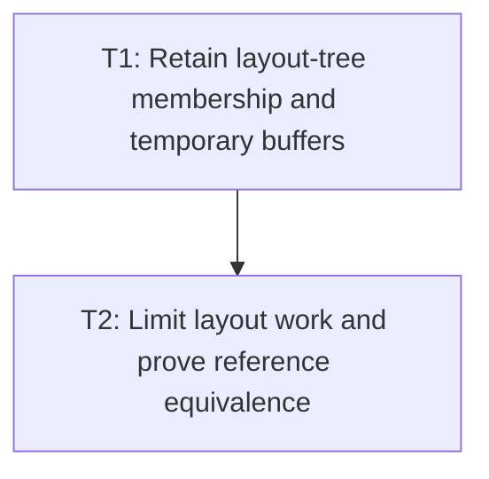

# P3: Retain Layout Structures and Validate Convergence

## Document Context

- Parent: [M5 - Add incremental style and retained layout boundaries](../M5%20-%20Add%20incremental%20style%20and%20retained%20layout%20boundaries.md)
- Children: None; tasks are contained in this phase document.
- Related: [P1 - Define dirty dependency and fallback contracts](P1%20-%20Define%20dirty%20dependency%20and%20fallback%20contracts.md), [P2 - Recalculate affected styles](P2%20-%20Recalculate%20affected%20styles.md), `LayoutServiceImpl`, `BlockLayout`, `InlineFormattingContext`, `FlexLayout`, `GridLayout`
- Next: None

## Goal

Reuse layout structures and buffers for proven affected formatting contexts while preserving geometry,
layout-child ownership, overflow, and scrollbar convergence. The implementation must retain the
force-full path whenever a dependency cannot be proven.

## Non-Goals

- Treating an individual node as independently layoutable when its containing context controls its
  size or position.
- Replacing block, inline, Flex/Yoga, or Grid algorithms with a new layout engine.
- Retaining stale inline fragments, positioned-child membership, scroll metrics, or transforms.

## Context

- `LayoutServiceImpl` currently recursively lays out the frame, rebuilds layout-child membership,
  updates nested scroll/client sizes, and resolves presentation transforms.
- `BlockLayout` can shift following flow siblings; `InlineFormattingContext` recomputes line
  construction; `FlexLayout` redistributes children through Yoga; `GridLayout` recomputes placement
  and tracks.
- Layout convergence is bounded by the existing scrollbar pass limit and must be compared against
  force-full execution.

## Phase Tasks

### T1: Retain layout-tree membership and temporary buffers

**Prerequisites:** P2.

**Purpose:** Separate stable layout-tree ownership from per-pass recomputation so unchanged structure
does not require rebuilding temporary wrapper trees.

**Changes:**

- [ ] Retain layout-tree membership and update it only after structural, visibility, display, or
  positioning changes.
- [ ] Reuse thread-confined `LayoutContext`-style state and temporary buffers with explicit reset and
  non-reentrant ownership rules.
- [ ] Preserve `layoutChildNodes`, `offsetParent`, hidden-subtree clearing, and positioned-child order.
- [ ] Define the retained structure's invalidation and teardown behavior for detach, reattach, and
  frame replacement.

**Acceptance Checks:**

- [ ] Structural and visibility transitions rebuild only required structures without stale descendants.
- [ ] Normal-flow and positioned layout-child membership matches the force-full reference after every
  attach, detach, reparent, display, and position transition.

**Risks:** Retained membership can outlive detached nodes or preserve stale offset parents; mitigate
with identity-based ownership checks and force-full rebuild on uncertain structural state.

### T2: Recalculate affected formatting contexts and ancestors

**Prerequisites:** T1.

**Purpose:** Implement the approved coarse-grained incremental layout behavior without claiming
isolated-node correctness.

**Changes:**

- [ ] Select affected roots according to P1: block-flow regions and following siblings, inline
  formatting contexts, whole flex containers, whole grid containers, positioned containing blocks,
  and required ancestors.
- [ ] Recompute affected descendants under the current containing constraints and propagate upward
  when border-box size, flow position, or scroll extent changes.
- [ ] Keep unaffected subtrees only when their layout inputs and containing constraints are unchanged.
- [ ] Preserve full fallback for unknown dependency, direct-alias mutation, failed layout, and
  unsupported display/positioning combinations.

**Acceptance Checks:**

- [ ] Text wrapping, block sibling placement, flex redistribution, and grid placement match the
  force-full reference.
- [ ] Incremental and force-full boxes, inline fragments, overflow, hit-test coordinates, and
  `offsetParent` relationships match across the scenario matrix.
- [ ] Unchanged and paint-only scenarios reduce layout-node visits without changing output.

**Risks:** A changed descendant can alter ancestor size or sibling placement unexpectedly; mitigate by
comparing outputs after each boundary and escalating propagation to the frame when dependencies are
not represented.

### T3: Preserve convergence, transforms, and publication safety

**Prerequisites:** T2.

**Purpose:** Integrate incremental layout with scrollbars, transforms, hidden subtrees, and E5 output
publication so partial results cannot be rendered as current.

**Changes:**

- [ ] Recompute affected scroll containers and bounded scrollbar passes, preserving the existing
  max-pass and non-convergence reporting behavior.
- [ ] Recompute presentation transforms when layout size or transform-origin inputs change, including
  required ancestor effects.
- [ ] Refuse publication on stale input, failed layout, or non-convergence and route to force-full
  retry.
- [ ] Add layout counters for affected roots, skipped subtrees, full fallbacks, convergence passes,
  and publication outcomes.

**Acceptance Checks:**

- [ ] Nested overflow, resize, transforms, hidden subtrees, hover/focus/pressed state, and scrollbar
  settling match force-full geometry and presentation results.
- [ ] No failed or unconverged incremental attempt is renderable.
- [ ] Repeated unchanged frames do not rebuild retained layout structures or traverse clean subtrees.

**Risks:** Scrollbar or transform dependencies can invalidate an apparently clean subtree; mitigate by
keeping scroll-container and percentage/origin dependencies explicit and falling back when unknown.

## Verification Strategy

- Run `:spinygui.core:test` focused on `BlockLayoutTest`, `FlexLayoutTest`, `InlineFormattingContextTest`,
  `OverflowLayoutTest`, `ParsedInlineWhitespaceLayoutTest`, and existing transform/interaction tests.
- Add a force-full versus incremental equivalence fixture covering unchanged, paint-only, text,
  block-flow, flex, grid, nested overflow, resize, transform, visibility, and structural mutation.
- Review deterministic counters before running matched benchmark recordings; structural equivalence is
  the acceptance gate, not timing alone.

## Dependency Graph

