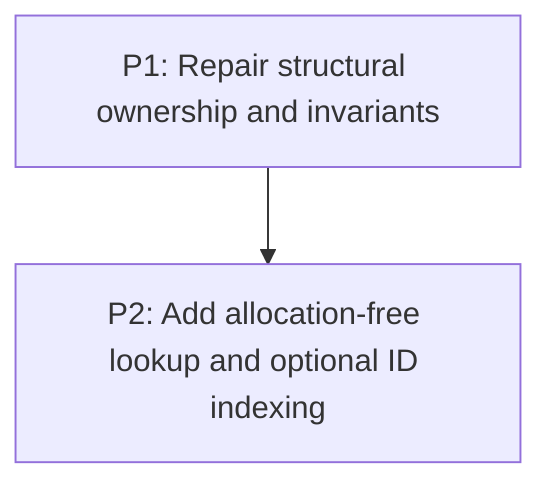

# M6: Harden Tree Mutation and Lookup

**Status:** Planned

Parent plan: `docs/work/E6 - Frame pipeline performance.md`

## Goal

Make structural mutation atomic and correct, then improve lookup from early-return traversal to a
frame index only after attachment and ID ownership are proven.

## Phases

### P1: Repair structural ownership and invariants
**Document:** [P1 - Repair structural ownership and invariants](M6/P1%20-%20Repair%20structural%20ownership%20and%20invariants.md)
**Depends on:** M1. **Enables:** P2. **Parallelizable with:** M2/P1, M3/P1, M4/P1.
**Purpose:** Establish one-owner attach/detach/move bookkeeping and prove tree invariants.

### P2: Add allocation-free lookup and optional ID indexing
**Document:** [P2 - Add allocation-free lookup and optional ID indexing](M6/P2%20-%20Add%20allocation-free%20lookup%20and%20optional%20ID%20indexing.md)
**Depends on:** P1. **Enables:** M5. **Parallelizable with:** M2/P2, M3/P2, M4/P2.
**Purpose:** Replace list-producing DFS, define duplicate IDs, and maintain an index only when safe.

## Milestone Validation
- Mutation sequences preserve all parent/sibling endpoint invariants and listener/focus behavior.
- Lookup never returns detached/stale elements and duplicate-ID behavior is explicit.

## Dependency Graph

