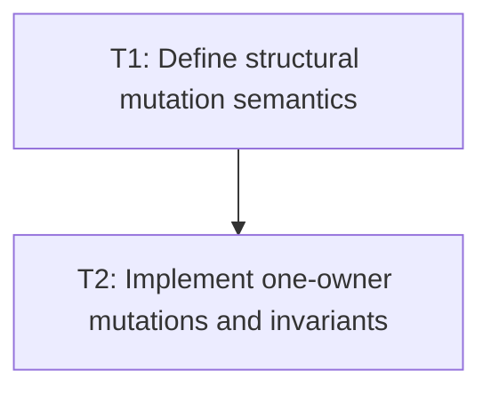

# P1: Repair Structural Ownership and Invariants

## Goal
Make attach, detach, and move bookkeeping single-owner, atomic, and fully testable.

## Phase Tasks
### T1: Define structural mutation semantics
**Depends on:** M1. **Enables:** T2. **Parallelizable with:** M2/P1, M3/P1, M4/P1.
**Changes:**
- [ ] Define parent reassignment, detach, endpoint, sibling-reference, presentation reset, listener, and focus semantics.
- [ ] Define identity-preserving move behavior without whole-list remove/re-add.
**Acceptance Checks:**
- [ ] Invariant tables cover roots, only child, endpoints, reparenting, detach, and reattach.

### T2: Implement one-owner mutations and invariants
**Depends on:** T1. **Enables:** P2. **Parallelizable with:** M2/P1, M3/P1, M4/P1.
**Changes:**
- [ ] Remove re-entrant parent/remove callbacks and update all links atomically.
- [ ] Add mutation-sequence tests including focus/listener and layout-child effects.
**Acceptance Checks:**
- [ ] No detached node retains stale parent/sibling links; endpoints are correct after every sequence.

## Verification Strategy
- Run node, parser, event/focus, and layout-tree tests.

## Dependency Graph

