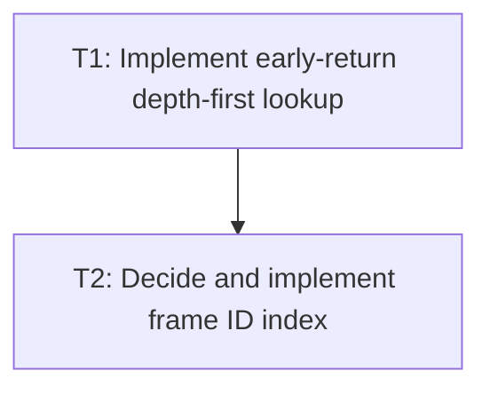

# P2: Add Allocation-Free Lookup and Optional ID Indexing

## Goal
Replace list-producing lookup immediately and add a frame index only after its ownership contract is safe.

## Phase Tasks
### T1: Implement early-return depth-first lookup
**Depends on:** P1. **Enables:** T2. **Parallelizable with:** M2/P2, M3/P2, M4/P2.
**Changes:**
- [ ] Replace allocating result-list/stream ID lookup with allocation-free early-return traversal.
- [ ] Preserve current first-match traversal order until duplicate-ID policy is approved.
**Acceptance Checks:**
- [ ] Lookup exits after the first matching branch and returns the same result as the reference traversal.

### T2: Decide and implement frame ID index
**Depends on:** T1. **Enables:** M5. **Parallelizable with:** M2/P2, M3/P2, M4/P2.
**Changes:**
- [ ] Define duplicate IDs and index visibility during attach, detach, reparent, and ID mutation.
- [ ] Add the index only if all mutation paths can update it atomically; otherwise retain DFS and document deferral.
**Acceptance Checks:**
- [ ] Index tests never return detached/stale elements and explicitly cover duplicate policy.

## Verification Strategy
- Run node/frame lookup and mutation regression tests.

## Dependency Graph

