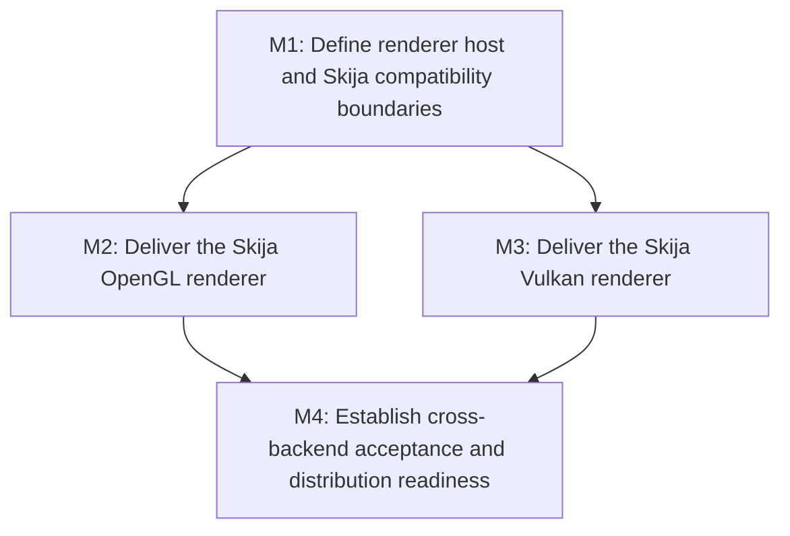

# E7: Skija Renderer Backends

## Document Context

- Parent: None.
- Children: Planned milestone documents under `docs/work/E7/`.
- Related: [Project Structure](../../PROJECT_STRUCTURE.md), [Agent Code Style And Principles](../../AGENTS_CODE_STYLE.md), [E6: Frame Pipeline Performance](E6%20-%20Frame%20pipeline%20performance.md).
- Next: M1 - Define renderer host and Skija compatibility boundaries.

## Goal

Add opt-in Skija renderers for OpenGL and Vulkan without removing, renaming, or changing the default
NanoVG backend. Each renderer is delivered as an independent Gradle subproject and renders the existing
styled and laid-out `Frame` through the backend-neutral `Renderer` SPI. The Vulkan implementation is
accepted only after a supported Skija/GLFW presentation path is demonstrated on the supported targets.

## Non-Goals

- Removing or refactoring the existing `spinygui.core.backend.lwjgl.nanovg` renderer beyond host-level
  decoupling necessary to support multiple rendering APIs.
- Replacing SpinyGUI's DOM, CSS, layout, input, event, or font-service ownership with HumbleUI.
- Building a custom Vulkan UI pipeline, glyph atlas, or direct LWJGL Vulkan renderer outside Skija.
- Promising pixel-identical output between NanoVG and Skija where the underlying rasterizers differ.
- Making Skija a transitive dependency of `spinygui.core`, `spinygui.core.backend`, or the aggregate
  `spinygui` module.

## Architecture Constraints

- The core remains backend-agnostic. Skija, GLFW, OpenGL, and Vulkan dependencies stay in concrete
  backend and host modules.
- Preserve the `Renderer` lifecycle (`initialize`, `render`, `destroy`) unless a demonstrated API
  insufficiency requires a separately reviewed SPI evolution.
- Add `spinygui.core.backend.skija.opengl` and `spinygui.core.backend.skija.vulkan` as separate Gradle
  subprojects. Neither depends on the NanoVG backend or the other Skija backend.
- The window host, not a renderer, owns GLFW initialization, event callbacks, and window destruction.
  API-specific context, swapchain, clear, resize, and presentation work must not remain hard-coded in
  the current OpenGL-only demo loop.
- Pin Skija to Maven Central version `0.143.17` for the initial work. Use platform-specific artifacts
  and keep native packaging explicitly tested per supported OS and architecture.
- Skija's repository describes the bindings as public alpha; its documented GLFW example is OpenGL,
  while Vulkan support must be validated by a source-compatible prototype before a production backend
  contract is committed.

## Milestones

### M1: Define Renderer Host and Skija Compatibility Boundaries

**Purpose:** Establish the module, lifecycle, native-resource, font-metric, and host/presentation
contracts required to run OpenGL and Vulkan renderers without leaking API details into core or altering
NanoVG behavior.

**Depends on:** None.

**Architectural Proposition:** Extract only the API-neutral GLFW event/window-loop responsibilities
from the complex demo host. Define an API-specific presentation boundary owned by each renderer or its
dedicated host adapter, then prove that the existing NanoVG demo runs unchanged in behavior through the
new boundary. Keep the two Skija subprojects independent; defer any shared Skija drawing abstraction
until both implementations demonstrate a stable, genuinely shared requirement.

**Key Work:**

- Define the Gradle module graph, Java module descriptors, platform-artifact resolution, and supported
  host matrix for `spinygui.core.backend.skija.opengl` and
  `spinygui.core.backend.skija.vulkan`.
- Separate GLFW window/event ownership from the OpenGL-specific capability creation, clear, viewport,
  swap, and NanoVG debug hooks in the complex demo host.
- Specify renderer initialization, framebuffer resize, device/context loss, native-resource cleanup,
  presentation, and thread-affinity ownership.
- Decide how Skija text measurement integrates with the existing `FontService` and `TextMeasurer`,
  including the acceptance boundary for layout-versus-paint metric differences.
- Record a small, version-pinned Vulkan feasibility spike using Skija `0.143.17`, GLFW, and a native
  window surface. The result must identify the actual Java API calls, resource ownership, resize path,
  and supported platform matrix, or stop Vulkan backend implementation.

**Open Questions:**

- Does the current minimal `Renderer` SPI have enough lifecycle information for Vulkan surface and
  framebuffer recreation, or should the host-presentation boundary be separate from it?
- Which platforms must pass the initial release matrix: Windows x64 only, or the full Skija artifact
  set for Windows/Linux/macOS and supported architectures?
- Should Skija font selection become an adapter over the existing font service, or may the renderer use
  an independently configured Skia font manager while layout remains unchanged?

**Validation:** The proposed module and host contracts compile with the existing NanoVG demo, its
window/input behavior remains intact, and the Vulkan spike produces a documented go/no-go result rather
than an inferred capability claim.

### M2: Deliver the Skija OpenGL Renderer

**Purpose:** Provide the first production-quality Skija backend using the repository's documented
OpenGL integration path and prove that the new renderer can render representative SpinyGUI scenes.

**Depends on:** M1.

**Architectural Proposition:** Use a GLFW OpenGL context and Skija's OpenGL `DirectContext`/backend
render target path. The renderer owns Skija surfaces and recreates size-dependent resources on
framebuffer changes; the host owns window events and buffer presentation. Map SpinyGUI layout-tree
traversal to Skija Canvas state, preserving paint order, transforms, clipping, and scroll coordinates.

**Key Work:**

- Create `spinygui.core.backend.skija.opengl`, with explicit Skija OpenGL and platform-native
  dependencies and no dependency on NanoVG.
- Implement Frame, element background, border, text, input, textarea, scrollbar, transform, and clip
  rendering needed by existing representative demos.
- Implement deterministic Skija resource lifecycle and framebuffer-resize handling; verify that all
  native resources are released at renderer shutdown.
- Add focused backend tests plus scene/image or structural assertions for the supported feature set.
- Add an opt-in demo launcher that selects the Skija OpenGL renderer while retaining all existing
  NanoVG launchers.

**Open Questions:**

- Which currently incomplete NanoVG features are parity targets versus explicitly unsupported in both
  backends?
- Can Skija paragraph shaping be used for paint while existing layout line breaks remain authoritative,
  or must text rendering initially use lower-level shaped runs to preserve layout coordinates?

**Validation:** The Skija OpenGL demo renders existing frame, text-input, textarea, overflow, and
transform scenarios; resize and shutdown are clean; and automated fixtures establish paint-order,
clipping, transform, and text-coordinate compatibility within documented tolerances.

### M3: Deliver the Skija Vulkan Renderer

**Purpose:** Provide an independent Vulkan-backed Skija renderer only after the M1 feasibility result
proves a supportable GLFW/Skija integration path.

**Depends on:** M1.

**Architectural Proposition:** The Vulkan subproject owns Skija's Vulkan context, GLFW-native surface
integration, swapchain/render-target management, synchronization, resize recreation, and presentation
as exposed by the pinned Skija version. Reuse behavioral fixtures from the OpenGL backend, but do not
couple either renderer to the other or assume their native lifecycle APIs are interchangeable.

**Key Work:**

- Create `spinygui.core.backend.skija.vulkan` with only its required LWJGL Vulkan/GLFW and Skija
  platform dependencies.
- Implement and test instance/device/surface selection through the Skija-supported integration API,
  including clear failure messages for unavailable Vulkan support.
- Implement swapchain/render-target lifecycle, synchronization, framebuffer resize, minimized-window
  handling, surface loss, and orderly shutdown.
- Map the same SpinyGUI rendering capabilities delivered in M2 to Skija Canvas and establish a Vulkan
  demo launcher independent of the OpenGL and NanoVG renderers.
- Add hardware-backed smoke tests where CI capabilities allow, with deterministic no-GPU/unsupported
  environment skips and manual target-platform verification instructions.

**Open Questions:**

- Does Skija `0.143.17` expose all required Vulkan surface and render-target construction APIs for the
  target GLFW platforms without unsupported native access?
- What device-loss and surface-recreation guarantees can the binding actually provide, and what is the
  host's recovery policy when they fail?

**Validation:** The Vulkan prototype's M1 acceptance criteria are met; a supported target renders,
resizes, minimizes/restores, and shuts down without native leaks or validation errors; unsupported
systems fail predictably without affecting NanoVG or Skija OpenGL availability.

### M4: Establish Cross-Backend Acceptance and Distribution Readiness

**Purpose:** Make the three renderer choices independently selectable and verify documented behavioral
coverage, platform packaging, and failure isolation before presenting Skija as a supported backend.

**Depends on:** M2, M3.

**Architectural Proposition:** Treat NanoVG, Skija OpenGL, and Skija Vulkan as separate optional
backends that consume the same already-styled and laid-out frame. Compare observable geometry and scene
semantics rather than raster-perfect pixels, with targeted image tolerances only for stable fixtures.

**Key Work:**

- Define a shared renderer conformance scene suite covering paint order, backgrounds, borders,
  transforms, rectangular and rounded clipping, nested scrolling, text selection/carets, controls,
  high-DPI framebuffer scaling, resize, and lifecycle cleanup.
- Establish backend-specific capability reporting and documented unsupported-feature behavior so a
  missing Vulkan driver or Skija native artifact cannot prevent NanoVG or OpenGL startup.
- Verify Gradle dependency resolution and Java module-path startup for every declared target artifact.
- Document backend selection, target matrix, native artifact size/distribution implications, known
  visual differences, and the public-alpha version-pinning policy.
- Keep existing NanoVG tests and demos as regression coverage; do not change their default behavior or
  dependency graph.

**Validation:** All three backends are buildable and independently runnable; the conformance suite has
explicit supported/unsupported outcomes per backend; platform packaging checks pass for the committed
target matrix; and no core or aggregate module acquires a Skija dependency.

## Cross-Cutting Risks

- Skija's Vulkan APIs may be incomplete or insufficiently documented for the required GLFW targets.
  Mitigation: M1 time-boxed prototype is a hard go/no-go gate for M3.
- Skija and existing layout metrics can diverge because shaping, fallback, hinting, and line breaking
  differ. Mitigation: define coordinate and line-break authority before renderer implementation and
  test representative Latin, combining-mark, RTL, emoji, and fallback-font fixtures.
- Vulkan lifecycle complexity can expand the `Renderer` SPI or contaminate the host. Mitigation: keep
  a dedicated host/presentation boundary and require a concrete API deficiency before changing the SPI.
- Native artifacts increase application distribution size and platform exposure. Mitigation: make
  backends opt-in subprojects with explicit platform artifacts and a tested support matrix.
- Parallel Skija backend work can duplicate drawing logic or diverge in behavior. Mitigation: share
  fixtures and acceptance semantics first; extract code only after both backends prove stable common
  behavior.

## Verification / Review Strategy

- Review M1 before implementation for dependency direction: core and `spinygui.core.backend` must stay
  free of Skija, OpenGL, Vulkan, and GLFW implementation dependencies.
- Run existing NanoVG backend tests and complex demos after host-boundary changes.
- Run module-specific unit tests and a manual high-DPI/resize/lifecycle demo for each Skija backend.
- Run Vulkan validation layers during supported manual/CI smoke tests when available; record driver,
  OS, JVM, LWJGL, and Skija versions with failures.
- Require cross-backend scene results and native-resource shutdown review before declaring either Skija
  renderer supported.

## Dependency Graph

