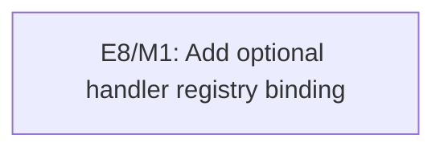

# E8: Declarative XML Event Binding

## Document Context

- Status: Planned
- Dependencies: None
- Parent: None
- Children: [M1 - Add optional handler registry binding](E8/M1%20-%20Add%20optional%20handler%20registry%20binding.md)
- Related: [E2 - Frame runtime integration](E2%20-%20Frame%20runtime%20integration.md), [Button element support](../features/button-element-support.md), [Style tag support](../features/style-tag-support.md)
- Next: [M1 - Add optional handler registry binding](E8/M1%20-%20Add%20optional%20handler%20registry%20binding.md)

## Goal

Allow XML views to declare named element-event handlers through automatically installed proxy
listeners that resolve an optional caller-owned typed `HandlerRegistry` at event-dispatch time. The
current handler attribute and registry contents may change without rebinding or rescanning the tree,
while the current parser and manual-listener workflow remains fully supported.

## Non-Goals

- Reflection-based controller discovery, field injection, annotations, or private-method invocation.
- Reactive property or collection binding, expressions, loops, includes, or template inheritance.
- Changing GUI event propagation, exact-class dispatch, input-impact classification, or native event
  ownership.
- Requiring `id` indexing or changing duplicate-ID behavior as a prerequisite for event binding.
- Moving CSS into XML or completing `<style>` support as part of this epic.

## Context

- `DefaultNodeParser` already preserves arbitrary element attributes and produces the existing
  `Node`/`Element`/`Frame` tree.
- `Element.addListener(...)` and `removeListener(...)` already provide the typed attachment boundary;
  the binding layer must use those APIs rather than introducing a second event bus.
- `DefaultEventProcessor` dispatches the exact runtime event class to the target element. Declarative
  binding must retain this behavior and must preserve a custom listener's `processWithImpact(...)`
  implementation.
- Jsoup HTML parsing normalizes markup names. Reserved handler attributes therefore use lowercase
  kebab-case names such as `on-action` and `on-click`.

## Assumptions and Decisions

- Proxy attachment is default loader behavior for each supported `on-*` declaration. Supplying a
  registry remains optional; templates can therefore load before application handlers are available.
- The proxy reads the declaration's current attribute value and resolves the current registry entry on
  every event. Direct `setAttribute(...)` changes and controlled registry replacement affect the next
  dispatch without rebinding or tree traversal.
- Loader initialization accepts a missing-handler policy with `ERROR`, `WARNING`, and `SILENT` values.
  `ERROR` is the safe default; `WARNING` skips dispatch and reports through the configured diagnostic
  sink; `SILENT` skips dispatch without reporting.
- The missing-handler policy applies both when no registry is available and when the current nonblank
  declaration has no exact-event-type registry entry. Blank or malformed declarations and event-type
  mismatches remain hard errors, including when introduced after loading and first observed at
  dispatch.
- The initial built-in XML vocabulary is `on-action` to `ActionEvent` and `on-click` to
  `MouseClickEvent`. Additional event attributes require separately tested explicit mappings.
- Registry entries are caller-owned typed `EventListener` instances keyed by a nonblank handler name.
  One name has one exact event type and may be referenced by more than one XML element.
- The installed proxy retains stable listener identity and delegates both `process(...)` and
  `processWithImpact(...)` to the handler resolved for the current dispatch.
- Registry mutation occurs on the owner UI thread between event batches; this epic does not promise
  concurrent or mid-dispatch mutation.

## Milestones

### M1: Add Optional Handler Registry Binding

**Purpose:** Deliver the typed registry, opt-in XML binding boundary, configurable missing-handler
policy, hard-failure diagnostics, focused coverage, and one representative demo without altering
existing parser or manual-listener behavior.

**Depends on:** None.

**Architectural Proposition:** Add a small backend-neutral binding package in `spinygui.core` that
composes the existing `NodeParser` and element listener APIs. During loading, automatically attach one
stable proxy for every supported declaration. At dispatch, the proxy reads the current handler name,
checks the optional registry, resolves the exact event type, applies the configured missing-handler
policy when resolution fails, and otherwise delegates to the current Java listener.

**Key Work:**

- Define a typed `HandlerRegistry` contract with controlled replacement and duplicate/name/type
  validation.
- Bind the reserved `on-action` and `on-click` attributes to existing GUI event classes.
- Automatically install proxies without requiring a registry or a separate binding lifecycle object.
- Resolve current attributes and registry entries per dispatch so direct attribute changes and handler
  replacement need no rebind operation.
- Produce actionable, source-oriented runtime diagnostics for missing registries, missing handlers,
  type mismatches, and malformed declarations without flooding repeated `WARNING` events.
- Migrate one complex demo to prove real XML-to-Java binding while retaining manual binding support.
- Publish the optional adoption path, safe `ERROR` default, and explicit permissive policies.

**Open Questions:**

- Whether more event attributes should be added after usage evidence, rather than exposing arbitrary
  event-class names in XML.

**Validation:** Existing parser and manual listener tests remain green; focused binding tests prove
automatic proxy attachment, optional registry resolution, all three missing-handler policies, exact
event dispatch, direct attribute changes, registry replacement, warning deduplication, and reusable
handler registration; the migrated demo compiles and preserves its observable activation behavior.

## Cross-Cutting Risks

- An accidental permissive configuration can create dead controls. Default to `ERROR`, make
  `WARNING` observable through an injectable diagnostic sink, and require an explicit `SILENT`
  selection.
- Repeated unresolved events can flood diagnostics in `WARNING` mode. Deduplicate by declaration
  identity and unresolved state, and permit a new warning after the attribute or registry changes.
- Wrapping listeners in plain lambdas can discard specialized input-impact reporting; the proxy must
  delegate both listener methods explicitly and define the skipped-dispatch impact conservatively.
- Event-time lookup adds map access to every declared event. Keep the initial vocabulary limited to
  action/click events and measure before applying this design to high-frequency pointer movement.
- Broad reflection or arbitrary event-class lookup would create JPMS, security, and diagnostics
  complexity beyond the requested capability.

## Verification / Review Strategy

- Review the public registry and loader/binder API before demo adoption.
- Run focused parser, binding, and event-processor suites after each contract change.
- Run `:spinygui.core:test`, `:spinygui.demo.complex:test`, and complex-demo compilation for final
  automated evidence; keep any native demo smoke evidence separate.
- Review source compatibility by keeping `NodeParser` and current `DefaultNodeParser.fromHtml(...)`
  call sites unchanged.

## Dependency Graph

