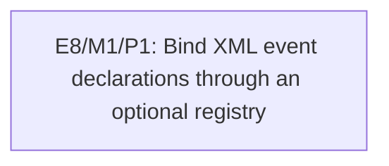

# E8/M1: Add Optional Handler Registry Binding

## Document Context

- Status: Planned
- Dependencies: None
- Parent: [E8 - Declarative XML event binding](../E8%20-%20Declarative%20XML%20event%20binding.md)
- Children: [P1 - Bind XML event declarations through an optional registry](M1/P1%20-%20Bind%20XML%20event%20declarations%20through%20an%20optional%20registry.md)
- Related: [Button element support](../../features/button-element-support.md)
- Next: [P1 - Bind XML event declarations through an optional registry](M1/P1%20-%20Bind%20XML%20event%20declarations%20through%20an%20optional%20registry.md)

## Goal

Provide one optional, backend-neutral path that loads an XML node tree and binds its named event
declarations to caller-provided Java listeners through a typed registry, with configurable handling of
an unavailable registry or unknown names, automatically installed resolving proxies, event-time
attribute lookup, and no change to existing parser or manual-listener behavior.

## Context

- The implementation belongs in `spinygui.core`; it depends only on parser, node, and GUI-event APIs.
- Registry absence is a supported runtime state of the resolving proxy, not a load failure and not a
  process-wide default registry.
- Binder/loader initialization owns an immutable missing-handler policy. `ERROR` is the default;
  `WARNING` uses an injectable diagnostic sink; `SILENT` requires an explicit choice.
- Registry mutations are confined to the owning UI thread between event batches. The installed proxy
  keeps listener identity stable and reads direct `Element.setAttribute(...)` changes on next dispatch.

## Architectural Proposition

Introduce `HandlerRegistry` plus an XML binder/loader in an exported binding package. The loader
composes an injected `NodeParser` and automatically attaches a stable proxy listener for every
supported `on-*` declaration. On each event the proxy reads the current attribute, checks whether a
registry is available, resolves the exact typed handler, applies `ERROR`, `WARNING`, or `SILENT` when
resolution fails, and otherwise delegates through the existing event pipeline.

## Plan

[P1 - Bind XML event declarations through an optional registry](M1/P1%20-%20Bind%20XML%20event%20declarations%20through%20an%20optional%20registry.md)

## Key Work

- Add the typed registry, controlled replacement, deterministic duplicate/name/type checks, and
  immutable binding options for `ERROR`, `WARNING`, and `SILENT` missing-handler behavior.
- Add explicit lowercase attribute mappings for `on-action` and `on-click`.
- Install resolving proxies by default for supported declarations and apply the configured policy to
  both an unavailable registry and a missing handler at dispatch time.
- Read current declaration values and registry contents per event; direct attribute mutation and
  handler replacement require no binding session or rebind pass.
- Preserve the existing parser interface and manually attached listener workflow.
- Prove the API in one XML demo and publish a minimal adoption guide.

## Validation

- Registry and binder unit tests cover success, automatic proxy attachment, optional registry state,
  all three missing-handler policies, dynamic attribute values, handler replacement, warning
  deduplication, and multiple XML references to one handler.
- Existing `DefaultNodeParserTest`, event-processor tests, and button input tests remain green.
- The representative complex demo compiles, its focused tests pass, and a native smoke check is
  recorded separately if run.

## Risks

- API convenience can accidentally couple parsing to application lifecycle. Keep controller ownership
  and handler construction outside core.
- `WARNING` that only writes to an internal logger is hard to verify or integrate. Route warnings
  through an injectable diagnostic sink and provide a documented default sink.
- Repeated unresolved dispatch can make `WARNING` noisy. Deduplicate identical unresolved states and
  warn again only after the declaration value or registry state changes.
- Reserving too many XML attributes prematurely can freeze unclear event semantics. Start with the two
  events that already have stable public behavior.
- Parser normalization can make camel-case declarations unreliable. Validate and document lowercase
  kebab-case only.

## Dependency Graph

